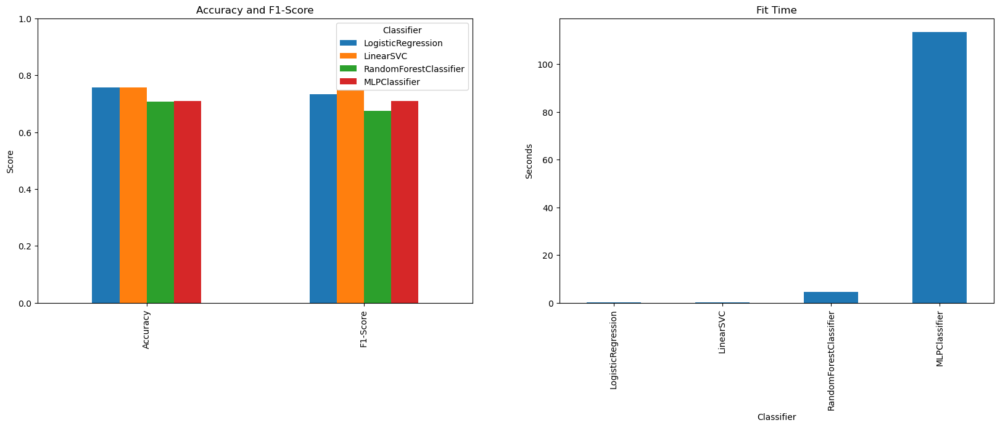

# Airline Tweet Sentiment Analysis

This project analyzes public sentiment toward US airlines using a variety of machine learning models. It was developed as a team submission for the Machine Learning course in the MSc in Data Science program at International Hellenic University.

## Overview

We explore how different vectorization techniques and classifiers perform in predicting tweet sentiment. The dataset is publicly available on Kaggle and contains tweets manually labeled as positive, negative, or neutral.

## Project context 

This work was conducted as a collaborative team effort for the Machine learning class of the Master’s program in Data Science at the International Hellenic University.

## Key features
- Preprocessing pipeline using `TfidfVectorizer`
- Cross-validation to prevent data leakage
- Multiple classifiers including Logistic Regression, SVM, Random Forest, and MLP
- Evaluation based on accuracy, F1-score, and training time
- Hyperparameter tuning with `GridSearchCV`
- Visual performance comparison across models

## Dataset

Source: [Kaggle - Twitter US Airline Sentiment](https://www.kaggle.com/datasets/crowdflower/twitter-airline-sentiment)  
The dataset includes over 14,000 tweets about major US airlines, labeled as `positive`, `neutral`, or `negative`.

## Models Used

- Logistic Regression
- LinearSVC
- Random Forest Classifier
- MLPClassifier (Feedforward Neural Network)
